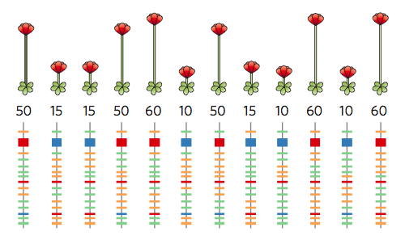
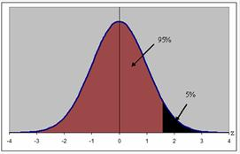
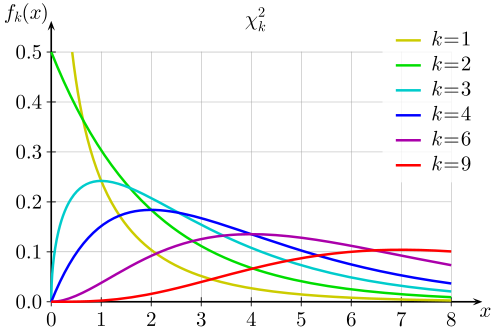
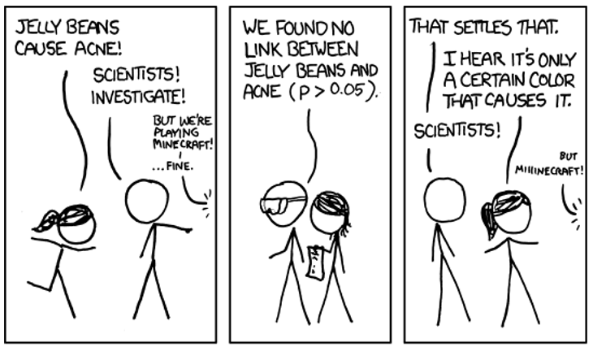
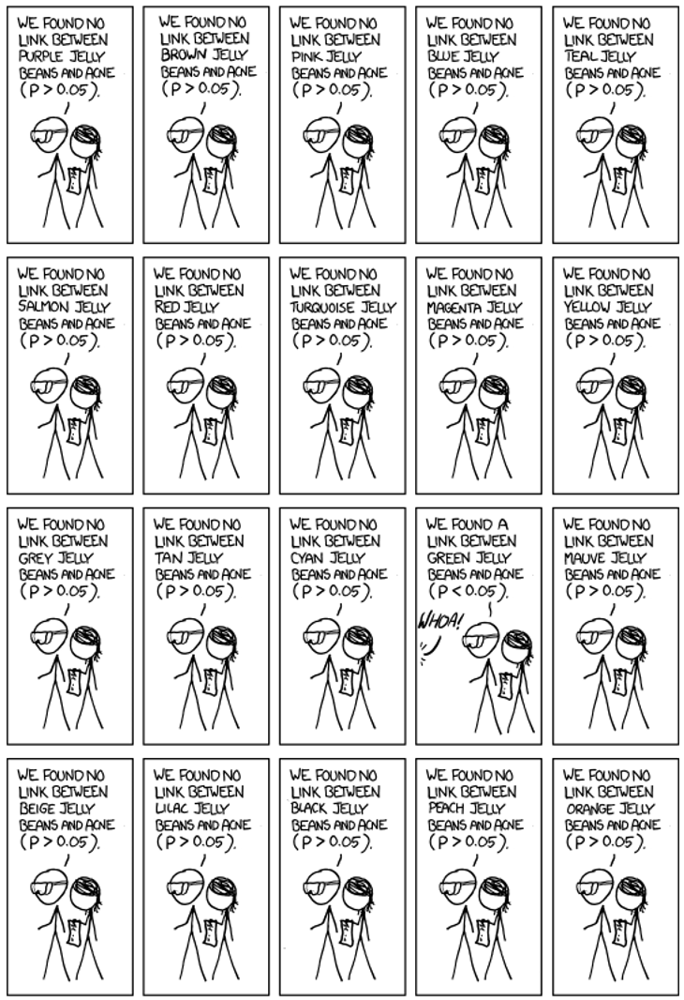
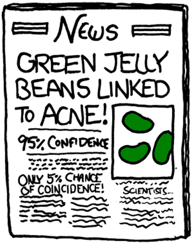
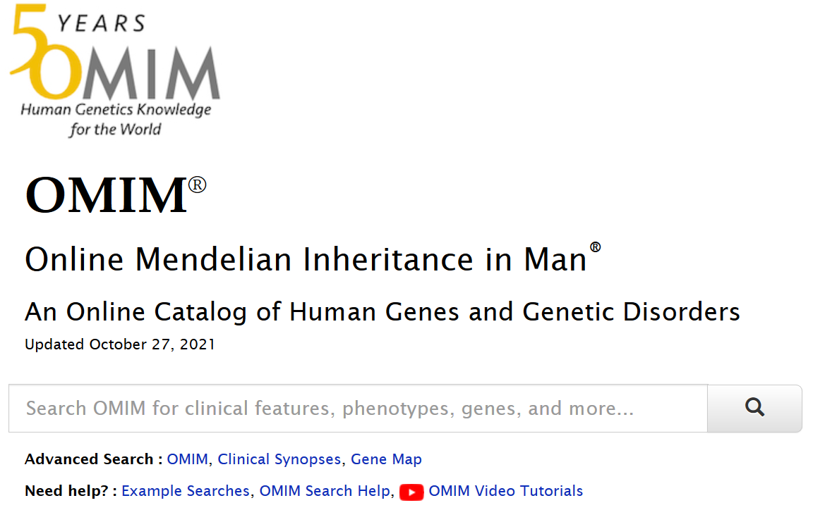

<!-- _class: lead -->

# High dimension low sample size
## (for studying genomes)

Cheng Soon Ong

---

## Why we will always have too many features

---

## Fundamental theorem of linear algebra

---

<!-- _class: lead -->

# A glimpse of genomics

http://www.ong-home.my/download/notes-gwas-hypo-test.pdf

---

# Genomics (I)

- **SNP**
    Single Nucleotide Polymorphisms or
    single nucleotide variations (SNVs) are mutations on a single
    nucleotide (A,C,T or G) in the genome.
    For example: AAGC C TA to AAGC T TA.
- **Alleles**
    There are two alleles: e.g. C and T.

---

# Genomics (II)

- **Major/Minor allele**
    The nucleotide that occurs commonly in the population is called the
    major allele (denoted by a capital $B$) and the nucleotide
    that occurs more rarely is called the minor allele (denoted
    by a small letter $b$).
- **Diploid**
    haploid $\Longrightarrow$ one chromosome set
    diploid $\Longrightarrow$ two chromosome sets
    hexaploid $\Longrightarrow$ six chromosome sets

---

# Genome wide association study

- **Genotype**
    The genotype is the specific combination of alleles.
- **Phenotype**
    The phenotype is the observable trait or characteristic of an individual, for example whether the individual is healthy or sick.
- **Case-control studies**
    A cohort of sick individuals (cases) and healthy individuals (controls) are genotyped and their corresponding binary phenotype are recorded.

---

<!-- _class: lead -->

# Statistical hypothesis testing

---

# Why Hypothesis Tests?
- Given a case control study, test whether a particular SNP is associated with the phenotype.
- Look through each SNP one by one, and test to see if there is a difference in the frequency of the alleles seen in cases versus controls.
- If difference is statistically significant
    $\Longrightarrow$
    SNP is associated with the phenotype.

---

# General framework (I)
- **null hypothesis $\mathcal{H}_0$**
    genotype is independent of the phenotype
- **alternative hypothesis $\mathcal{H}_1$**
    SNP is associated with the disease state
- **hypothesis test** can be stated as follows
    $$
    \mathcal{H}_0: \theta \in \Theta_0
    \qquad\mathrm{and}\qquad
    \mathcal{H}_1: \theta \in \Theta_1.
    $$
---

# General framework (II)
- **Important design choices**
    - How to represent intuition as a probabilistic model?
    - How to decide on a test statistic?
    - What is the distribution of the random variable?
    - What is the level of significance ($\alpha$)?

- Sinsheimer, Statistics 101 -- A Primer for the Genetics of Complex Human Disease, 2011
- Agresti, Categorical Data Analysis, 2002
- Wasserman, All of Statistics, 2004

---

# Hypothesis test

- Let $X$ be a random variable with range $\mathcal{X}$.
- $R\subset\mathcal{X}$ called the rejection region
- If $X\in R$ then we reject the null hypothesis, otherwise we do not reject the null hypothesis.
    $$
    R = \left\{ x:T(x) > c \right\}
    $$
    where $T$ is a test statistic and $c$ is a critical value.
- The p-value is the probability of obtaining a test statistic at least as extreme as the one that was actually observed, assuming that the null hypothesis is true.

--- 

# Outcomes (I)

- **Outcomes of hypothesis tests**

    |        | Accept $\mathcal{H}_0$ | Reject $\mathcal{H}_0$ |
    |:-------|:----------------------:|:----------------------:|
    | $\mathcal{H}_0$ true | correct | type I error |
    | $\mathcal{H}_1$ true | type II error | correct|

- **Significance level**
    The probability of a rejecting $\mathcal{H}_0$ when it is true is called the significance level.

--- 

# Outcomes (II)

- **p-value vs significance**
    - Reject $\mathcal{H}_0$ when 
        p-value $<$ significance level
    - p-value is computed from observation
    - significance level is chosen by expert

---

# Allelic test of association

- Single locus, haploid genome
- 200 individuals: 100 cases, 100 controls
- $B$ and $b$ are equally common in the population
- **Null hypothesis**
    No association between the allele and the phenotype

|        | allele $B$ | allele $b$ |
|:-------|:----------:|:----------:|
| Case | 50 | 50 |
| Control | 50 | 50 |

---

# Allelic test of association

- Single locus, haploid genome
- 200 individuals: 100 cases, 100 controls
- $B$ and $b$ are equally common in the population
- **Null hypothesis**
    No association between the allele and the phenotype

|        | allele $B$ | allele $b$ |
|:-------|:----------:|:----------:|
| Case | 50 ($E_{B,1}$) | 50 ($E_{b,1}$) |
| Control | 50 ($E_{B,0}$) | 50 ($E_{b,0}$) |

Let's name the variables

---

# Experimental Observation

We go out and measure some genotypes, and observe...

|        | allele $B$ | allele $b$ |
|:-------|:----------:|:----------:|
| Case | 23 ($O_{B,1}$) | 77 ($O_{b,1}$) |
| Control | 68 ($O_{B,0}$) | 32 ($O_{b,0}$) |

---

# Pearson $\chi^2$ test of independence

Is the expected table ($E_{v,i}$) and the observed table ($O_{v,i}$)
"the same"?

Calculate their normalized distance:
$$
  X^2 = \sum_{i\in \{0,1\}}\sum_{v\in \{B,b\}}\frac{ (O_{v,i}-E_{v,i})^2} {E_{v,i}}.
$$

---

# Chi squared distribution

$$
  f(x;k) =
  \begin{cases}
    \frac{\displaystyle
      x^{\left(\frac{k}{2}-1\right)}\exp\left(-\frac{x}{2}\right)}{\displaystyle
      2^{\left(\frac{k}{2}\right)}\Gamma\left(\frac{k}{2}\right)},
    &\qquad x\geqslant 0\\
    0&\qquad\mathrm{otherwise}
  \end{cases}
$$

where $k$ is called the degrees of freedom

http://en.wikipedia.org/wiki/Chi-squared_distribution

---

# $\chi^2$ test (I)

|        | allele $B$ | allele $b$ |
|:-------|:----------:|:----------:|
| Case | 50 ($E_{B,1}$) | 50 ($E_{b,1}$) |
| Control | 50 ($E_{B,0}$) | 50 ($E_{b,0}$) |

|        | allele $B$ | allele $b$ |
|:-------|:----------:|:----------:|
| Case | 23 ($O_{B,1}$) | 77 ($O_{b,1}$) |
| Control | 68 ($O_{B,0}$) | 32 ($O_{b,0}$) |

$$
\begin{aligned}
    X^2&=
    \displaystyle\frac{(23-50)^2}{50}+\frac{(77-50)^2}{50}+\frac{(68-50)^2}{50}+\frac{(32-50)^2}{50}\\\\
    &=42.12
\end{aligned}
$$

---

# $\chi^2$ test (II)

|        | allele $B$ | allele $b$ |
|:-------|:----------:|:----------:|
| Case | 50 ($E_{B,1}$) | 50 ($E_{b,1}$) |
| Control | 50 ($E_{B,0}$) | 50 ($E_{b,0}$) |

|        | allele $B$ | allele $b$ |
|:-------|:----------:|:----------:|
| Case | 23 ($O_{B,1}$) | 77 ($O_{b,1}$) |
| Control | 68 ($O_{B,0}$) | 32 ($O_{b,0}$) |

What is the probability of observing a value greater than 42.12 of a
$\chi^2$ random variable given that the null hypothesis is true? p-value
$$
    \mathbb{P}(X^2 > 42.12) < 10^{-10}.
$$

---

# The p-value is not ...

- ... the probability that the null hypothesis is true.
-  ... the probability that a finding is ``merely a fluke''.
-  ... the probability of falsely rejecting the
  null hypothesis.
-  ... the probability that a replicating
  experiment would not yield the same conclusion.
-  ... indicating the size or importance of the
  observed effect.
-  The significance level of the test is not determined by the p-value.

---

# Jelly beans cause acne?

https://xkcd.com/882/

 &emsp; &emsp; &emsp; &emsp; &emsp;  

---

# Family wise error rate (FWER)

- **$M$ hypothesis tests**
    $$
    \mathcal{H}_{0m}\qquad\mathrm{versus}\qquad\mathcal{H}_{1m},\qquad m=1,\ldots,M
    $$
    and let $p_1,\ldots,p_M$ denote the $M$ p-values for these tests.
- **Bonferroni Method**  &emsp;  Reject null hypothesis $H_{0m}$ if
    $$
    p_m < \displaystyle\frac{\alpha}{M}.
    $$
- **Outcome**
    The probability of falsely rejecting any null hypothesis is less than
    or equal to $\alpha$.

---

# False discovery proportion

Let $M_0$ be the number of null hypotheses that are true.
$$M_1 = M - M_0$$

Define the false discovery proportion (FDP)
$$
    \mathrm{FDP} =
    \begin{cases}
        V/R & \mathrm{if~} R>0\\
        0 & \mathrm{if~} R = 0.
    \end{cases}
$$

|    | $\mathcal{H}_0$ accepted | $\mathcal{H}_0$ rejected | Total |
|:---|:------------------------:|:------------------------:|:-----:|
| $\mathcal{H}_0$ true | $U$ | $V$ | $M_0$ |
| $\mathcal{H}_0$ false | $T$ | $S$ | $M_1$ |
| Total | $M - R$ | $R$ | $M$ |

---

# False discovery rate
- **$M$ hypothesis tests**    We order the p-values in increasing order.
- **Benjamini-Hochberg Method**
    1. For a given $\alpha$, find the largest $k$ such that $p_k\leqslant k \frac{\alpha}{M}.$
    2. Then reject all $\mathcal{H}_{0m}$ for $m=1,\ldots,k$.
    3. **Theorem**
        $$
        \mathrm{FDR} = \mathbb{E}(\mathrm{FDP}) \leqslant \frac{M_0}{M}\alpha
        \leqslant \alpha.
        $$
    4. **Outcome** For a given significance level $\alpha$, the Benjamini Hochberg method bounds the false discovery rate.

---

# Multiple testing

Suppose 800 of 500,000 variants are significant at 0.05 level.

- **p-value < 0.05**
    Expect 0.05 * 500000 = 25000 false positives
- **false discovery rate < 0.05**
    Expect 0.05 * 800 = 40 false positives
- **family wise error rate < 0.05**
    The probability of at least 1 false positive < 0.05

---

### The basics of hypothesis testing applied to GWAS

- **Some Genomics Nomenclature**
    GWAS, SNPs, Allele, Diploid, Genotype, Phenotype
- **Hypothesis Testing**
    - $\mathcal{H}_0$ vs $\mathcal{H}_1$
    - Design test statistic and compute p-value
    - Reject $\mathcal{H}_0$ if p-value $<~\alpha$.
- **Multiple Testing Correction**

http://www.ong-home.my/download/notes-gwas-hypo-test.pdf

---

# Epistatic Interactions (I)

- **Genome Wide Interaction Search (GWIS)**
    Consider the association of all pairs of genotypes to phenotypes
- **Large search space**
    * 5000 individuals, 500,000 SNPs
    * Need to tabulate 125 billion contingency tables

---

# Epistatic Interactions (II)

- **Classification based analysis**
    * Focus on SNPs in case control studies
    * New statistical tests
    * Consider specificity and sensitivity
    * Gain over univariate ROC
    * CPU ($\approx$ days) and GPU ($\approx$ hours)

Goudey et. al. BMC Genomics, 2013
