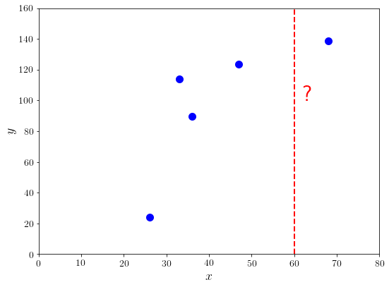

## Overview

What do we do after we have a predictor?
- Active learning
- Bandits and Bayesian Optimization
- Choice Theory
- Design of Experiments

---

## Discuss RBS experiment

---

## Opportunities and challenges

[WCB workshop paper](https://icml-compbio.github.io/2021/papers/WCBICML2021_paper_8.pdf)

- Generalization from Ribosome Binding Site to other regulatory sequences
- Exploration-Exploitation tradeoff in bandits
- Interdisciplinary Collaboration

---

# Same words can mean different things

(English is not powerful enough)

---

## Warm up

What is a weighted average?

---

### Shameless advertising

{ height=300 }

---

## Three major components

- **Data** - next two slides
- **Models** - this lecture
- **Learning** - many good references

---

## Data (pretend employees)

| Name | Gender | Degree | Postcode | Age | Salary |
|:-----|:------:|:-------|:--------:|----:|-------:|
Aditya | M | MSc | W21BG | 36 | 89563 |
Bob | M | PhD | EC1A1BA | 47 | 123543 |
Chloe | F | BEcon | SW1A1BH | 26 | 23989 |
Daisuke | M | BSc | SE207AT | 68 | 138769 |
Elisabeth | F | MBA | SE10AA | 33 | 113888 |

---

## Data as vectors

Gender ID | Degree | Latitude  |  Longitude  |  Age | Annual Salary |
|:-------:|:-----------:|---------------:|------------:|-----:|--------------:|
|  |   | (degrees) | (degrees) |  | (thousands) |
-1 | 2 | 51.5073 | 0.1290 | 36 | 89.563 |
-1 | 3 | 51.5074 | 0.1275 | 47 | 123.543 |
+1 | 1 | 51.5071 | 0.1278 | 26 | 23.989 |
-1 | 1 | 51.5075 | 0.1281 | 68 | 138.769 |
+1 | 2 | 51.5074 | 0.1278 | 33 | 113.888 |

---

# Four Pillars

- Supervised
  * Regression
  * Binary classification
- Unsupervised
  * Density estimation
  * Dimensionality reduction

_"Mathematics is the music of reason."_
_-- Paul Lockhart, Mathematician's Lament - 2009_

---

## Supervised learning

- Define input space $\mathcal{X}$, usually $\mathbb{R}^D$.
- Define output space $\mathcal{Y}$
- Find a function $\mathbf{f}$

$$\mathbf{f} : \mathcal{X} \to \mathcal{Y}$$

---

## Regression

$$\mathbf{f} : \mathcal{X} \to \mathcal{Y}$$

- input ($\mathcal{X}$): real valued vector
- output($\mathcal{Y}$): real valued scalar

---

## Example of regression task

:::::::::::::: {.columns}
::: {.column width="50%"}

- $\mathcal{X}$ = age, $\mathcal{Y}$ = salary
- Data from example table (training data)
- Interested in unobserved salary (e.g. $x=60$)

:::
::: {.column width="50%"}

{ height=300 }

:::
::::::::::::::

---

## Binary classification

- input: real valued vector
- output: binary outcome (usually {0,1} or {-1, +1})

. . .

- Three ideas with the same name (classifier $\mathbf{f}$)
  $$\mathbf{f} \equiv \text{threshold}[ \varphi (\mathbf{\theta}^{\top} \mathbf{x}) ]$$
  * **score** $\mathbf{\theta}^{\top} \mathbf{x}$
  * **class probability** $\Longleftarrow$ inverse link function $\varphi(\cdot)$
  * **decision making** threshold

---

## Why two supervised learning tasks?

- Assume input space $\mathcal{X}$ is $\mathbb{R}^D$
- Output space $\mathcal{Y}$
  * Real valued (continuous)
  * Binary (discrete)
- Qualitatively different
  * mathematics, algorithms, computer representation
- Other supervised tasks
  * multiclass, multi-output, structured prediction

---

## Unsupervised learning

- Given some data $\mathcal{X}$, assume vector in $\mathbb{R}^D$
- Find some structure
  - Where is the data clumped?
  - Can we summarise the features?
- Unsupervised = no labels $\mathcal{Y}$

---

## Density estimation

(_Where is the data clumped?_)

- input: set of real valued vectors
- output: probability density

. . .

- **Assume** data is not uniformly distributed
- Think of probability densities as histograms
- Gaussian distributions (and their mixtures) are very useful
- Clustering is a kind of density estimation

---

## Dimensionality reduction

(_Can we summarise the features?_)

- input: real valued vector (high dimensional)
- output: real valued vector (low dimensional)

. . .

- **Assume** data lies on a lower dimensional space
- Think of a surface in a larger space
- Linear surfaces (and locally linear versions) are very useful
- Principal component analysis finds the best linear subspace

---

# Four Pillars

:::::::::::::: {.columns}
::: {.column width="60%"}

- Supervised
  * Regression
  * Binary classification
- Unsupervised
  * Density estimation
  * Dimensionality reduction

:::
::: {.column width="40%"}

](figs-book/cover.png){ height=300 }

:::
::::::::::::::

---

# Use cases

*Applications in the machine learning and artificial intelligence future science platform*

https://research.csiro.au/mlai-fsp/

- Bushfire modelling
- Galaxy classification
- Adaptive design of genomes

---

# Where does progress come from?

---

*Machine learning is a multi-disciplinary field, and progress in research builds on ideas from all areas.*

- Learn computing systems
- Learn computer science
- Learn mathematics and statistics
- Learn about problem domain

---

## Computing systems - GPU

(_Slightly parallel computing is useful_)

_There is a feedback loop connecting hardware, software, and the states of their markets. Software
architectures are built to take advantage of available hardware while the hardware is built to enable
new software capabilities._
Raschka, Patterson, Nolet, Machine Learning in Python ... , 2020

---

## Computing systems - GPU

(_Slightly parallel computing is useful_)

- single instruction multiple thread
- n-dimensional arrays and vectorized operations
- automatic differentiation
- Interoperability and governance

---

## Computer science - homomorphic encryption

- Perform calculations on encrypted data
- Ring learning with errors
  * Generalization of parity learning
  * Find a function that fits, and a witness
- Related to:
  * privacy preserving computation
  * secure multi-party computation

---

## Math - high school gradients

This is an equation
    $$y = x^3 + 2x^2 + x + 4$$
What is the gradient $\frac{\mathrm{d}y}{\mathrm{d}x}$?

. . .

$$\frac{\mathrm{d}y}{\mathrm{d}x} = 3x^2 + 4x + 1$$

. . .

Observe that we can write the equation as
$$x^3 + 2x^2 + x + 4 - y = 0$$
which is of the form $H(x,y)=0$.

---

## Math - implicit differentiation

This is an equation
    $$y = x^3 + 2x^2 + \underbrace{xy}_\text{new} + 4$$
What is the gradient $\frac{\mathrm{d}y}{\mathrm{d}x}$?

. . .

- Deep Declarative Networks
  https://anucvml.github.io/ddn-cvprw2020/
- Implicit function theorem (Augustin-Louis Cauchy, 1916)

_Computing gradients is computationally easier than computing integrals_

---

## Learn about society

:::::::::::::: {.columns}
::: {.column width="50%"}

- Data is measured for a reason (capta)
- Should ML be applied to predict behaviour?
- Think critically about evidence

:::
::: {.column width="50%"}

{ height=300 }

:::
::::::::::::::

---

## Society - some literature

- _Stray, Curious Journalist's Guide to Data, 2016_
- _Kasy, Abebe, Fairness, Equality, and Power in Algorithmic Decision-Making, 2020_
- _Bergstrom, West, Calling Bullshit: The Art of Skepticism in a Data-Driven World, 2020_

---

## My personal interests

_Where to measure?_

- **A**ctive learning
- **B**andits or **B**ayesian Optimization
- **C**hoice Theory
- **D**esign of **E**xperiments

---

# Learn about the domain

most machine learning value comes from finding a good formalization of a problem

---

## Summary

- (four) **Machine learning tasks**
  * *Classification, regression, density estimation, dimensionality reduction*
- (a few) **Applications in CSIRO**
  * *Bushfires, galaxies, genomics*
- (some ways of) **Making progress**
  * *Machine learning for science*

---

## Thank you

:::::::::::::: {.columns}
::: {.column width="60%"}

[research.csiro.au/mlai-fsp/](https://research.csiro.au/mlai-fsp/)

[chengsoon.ong@anu.edu.au](mailto:chengsoon.ong@anu.edu.au)

[\@ChengSoonOng](https://twitter.com/ChengSoonOng)

:::
::: {.column width="40%"}

](figs-book/cover.png){ height=300 }

:::
::::::::::::::
