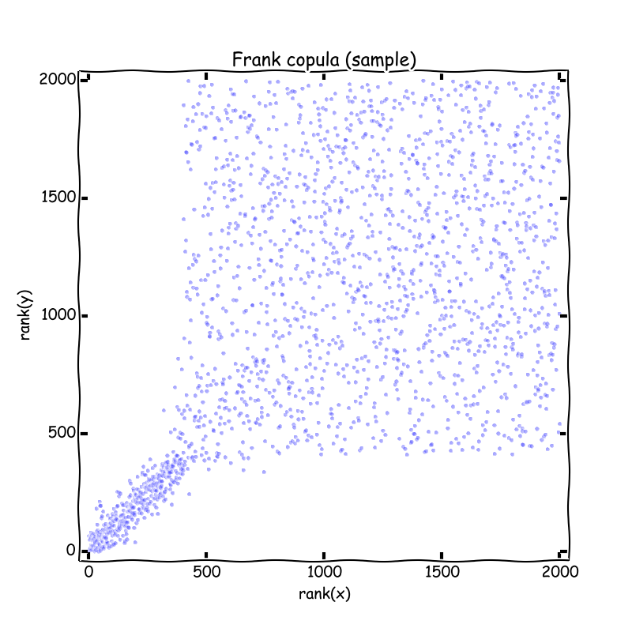
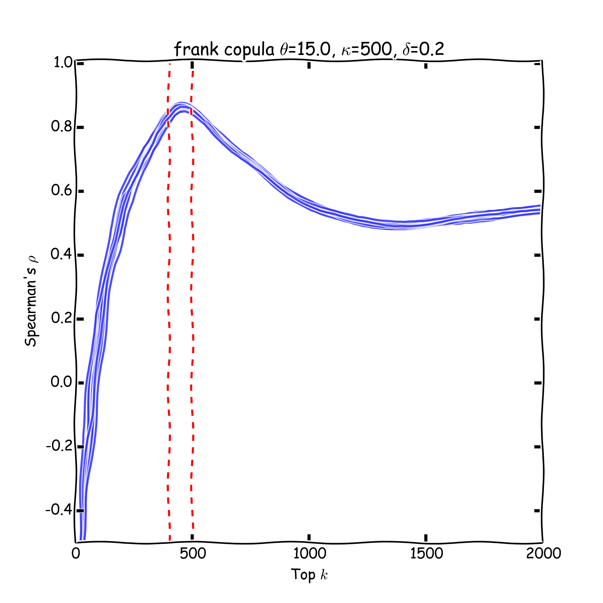
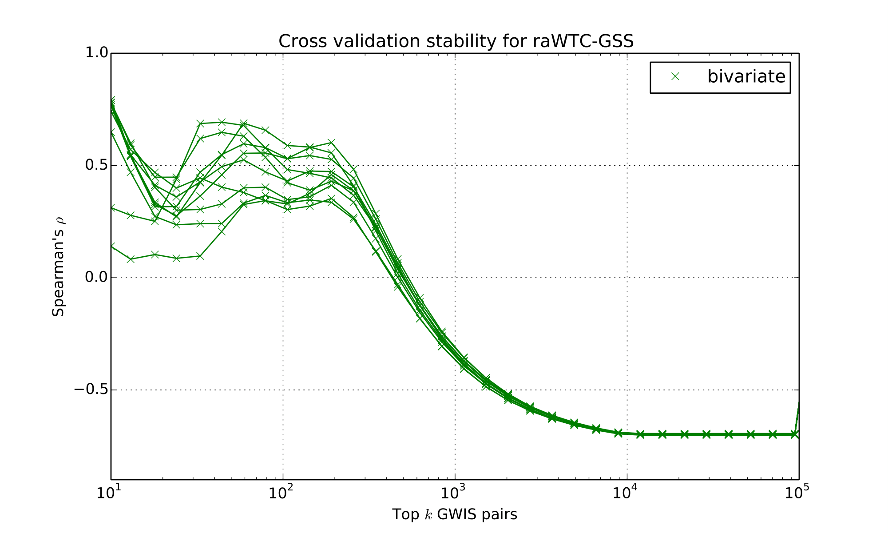
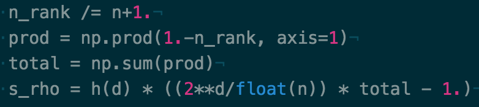
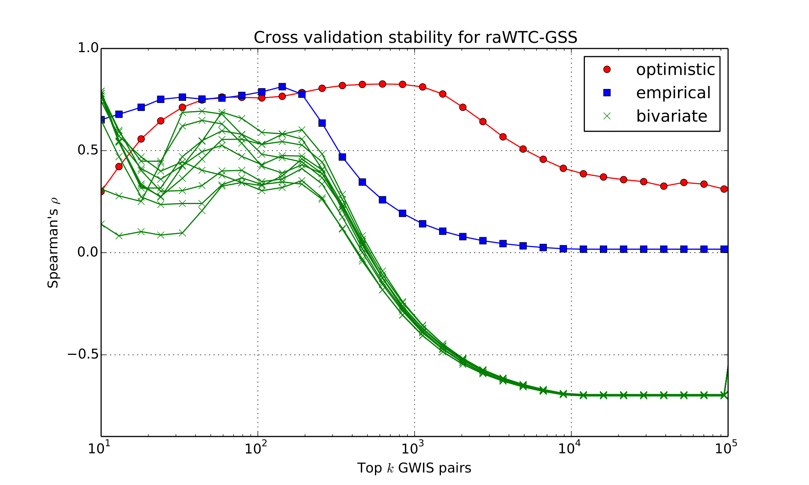

<!-- _class: lead -->

# Stability and Rank aggregation

Cheng Soon Ong

---

## Motivation: Genome wide association study

- **Hypothesis testing** Given a case control study, test whether a particular SNP is associated with the phenotype.
- **Epistatic Interactions**
    -  Need to tabulate 125 billion contingency tables
    -  Consider specificity and sensitivity
    -  Gain over univariate ROC
    -  CPU ($\approx$ days) and GPU ($\approx$ hours)
    -  Store the top 1 million pairs
  
Goudey,...,Ong,...,Kowalczyk, BMC Genomics, 2013

---

- **Quote** about p-values
    ... but a reliable method of procedure. In relation to the test of significance, we may say that a phenomenon is experimentally demonstrable when we know how to conduct an experiment which will rarely fail to give us a statistically significant result.
    Fisher, The Design of Experiments, 1947, p. 14

---

# Linear regression for feature selection

---

# p-value

- **Interpreting p-values**
    Is $10^{-10}$ probability of association very significant?
- **Stability of scoring**
    We consider p-values as a score of association.
    - How stable is this score if we repeat the experiment?
    - How do we combine scores?
- **Challenges**
    - Scores available for only the top-k examples
    - Scores from different sources not calibrated

---

<!-- _class: lead -->

# Use p-values as a score

---

## Modeling using Spearman's correlation

- **Stability of feature selection**
    How to measure overlap?
- **Rank aggregation**
    How to combine different sources of information?

---

# Multiple ways to represent ranks
-  Ordered list of $n$ objects selected from $\Omega$
-  List of values $[1,\ldots,n]$ (the ranks of the object)
-  Normalised ranks $\in(0,1)$
-  Permutation mapping $R:\Omega\to (0,1)$

---

# Measuring Overlap

- **Motivation**
    Given a set of replicated experiments, how do we measure overlap?
- **Examples**
    -  Perform repeated splits of the data
    -  Experiments on different cohorts
    -  Multiple sources of information
- **Challenges**
    -  Scores available for only the top-k examples
    -  Scores from different sources not calibrated

---

# Signal and Noise

---

# Running example

(6 objects)

$$
    A = [a,b,c,d,e,f]
$$

$$
    B = [a,b,e,f,c,d]
$$

---

# Set based overlap

- **Jaccard Index**
    $$
    \mathrm{overlap} = \frac{|A\cap B|}{|A\cup B|}
    $$
- **Measuring stability** for top-k lists
    - Consider the top-3 lists in running example:
        $$
        \mathrm{Jaccard~index} = \frac{|\{a,b\}|}{|\{a,b,c,e\}|}
        = \frac{1}{2}
        $$
    -  Ignores the order given by scores

---

# Spearman's $\rho$

  -  Similar to Pearson's correlation for the measure of dependence
  -  Spearman's $\rho$ is a correlation measure between ranked lists
  $$
    \rho(A,B) :=
    \frac{\sum_i(r_A^{(i)}-\bar{r}_A)(r_B^{(i)}-\bar{r}_B)}
    {\sqrt{\sum_i(r_A^{(i)}-\bar{r}_A)^2\sum_i(r_B^{(i)}-\bar{r}_B)^2}},
  $$
  - Running example:
    $$\rho([a,b,c,d,e,f],[a,b,e,f,c,d]) = 0.543$$
    (Jaccard index $=1$)

---

# Issue with classical Spearman's $\rho$

  - Need the same elements in $A$ and $B$
    $$
    \rho([a,b,c], [a,b,e]) \mathrm{~?}
    $$

---

# Spearman's $\rho$ on top $k$ lists
- **Our idea**
    Define Spearman's $\rho$ for top $k$ lists
- **Key observation**
    Any elements in list $A$ that do not appear in list $B$ must have
    a rank higher than the number of elements in $B$

---

# Spearman's $\rho$ on top $k$ lists

- **Running example (top-3)**
    $$
    A = [a,b,c,d,e,f]\qquad\mathrm{and}\qquad     B = [a,b,e,f,c,d]
    $$
    $$
    A_3 = [a,b,c]\qquad\mathrm{and}\qquad     B_3 = [a,b,e]
    $$
    $$
    A_3\overset{B_3}{\rightarrow} =  [a,b,c,e]\qquad\mathrm{and}\qquad
    B_3\overset{A_3}{\rightarrow} = [a,b,e,c]
    $$

    Spearman's $\rho = \rho(A_3\overset{B_3}{\rightarrow} , B_3 \overset{A_3}{\rightarrow})
    = 0.8$

---

# Spearman's $\rho$ on top $k$ lists

- **Extend the list**
    We expand lists $A$ and $B$ to complete
    rankings over the same set of elements, denoting them as
    $A\overset{B}{\rightarrow}$ and $B\overset{A}{\rightarrow}$ respectively.
    The missing values in the extension are given the average rank.
- **Running example (top-4)**
    $$
    A_4 = [a,b,c,d]\qquad\mathrm{and}\qquad     B_4 = [a,b,e,f]
    $$
    $$
    A_4\overset{B_4}{\rightarrow} =  [1,2,3,4,5.5,5.5]\qquad\mathrm{and}\qquad
    B_4\overset{A_4}{\rightarrow} = [1,2,5.5,5.5,3,4]
    $$
    Makes no assumption about the order of the unranked objects

---

# Signal and Noise

 &emsp; &emsp; 

---

# Wellcome Trust arthiritis data

Bedő, Rawlinson, Goudey, Ong, PLoS ONE, 2014

---

# Spearman's $\rho$ on top $k$ lists

- **Other possible imputation approaches**
    - Optimistic
    - Worst case
    - Bedő, Rawlinson, Goudey, Ong, PLoS ONE, 2014
- **Multivariate Spearman's correlation**
    - Textbook Spearman's $\rho$ is for computing correlation between two ranks. We want to compute the correlation between multiple ranked lists.

---

<!-- _class: lead -->

# Rank aggregation

---

## Motivation: combine sources of information

---

# Briefly: multivariate Spearman

- Spearman correlation can be expressed in terms of a copula
- **Intuition** Copulas model the dependence component after discounting for univariate marginal effects
- The connection to copulas enables the definition of Spearman correlation between more than two ranked lists
$$\rho(R_1, \dots, R_d)$$

Bedő, Ong, JMLR 17(201):1--30, 2016

---

# Multivariate Spearman correlation

Empirical multivariate Spearman's corelation
$$
\rho_n(R_1, \ldots, R_d) = h(d)\left[
    \frac{2^d}{n} \sum_{x} \prod_{j=1}^d R_j(x) - 1
\right]\quad\mathrm{where}\quad h(d) = \frac{d+1}{2^d - (d+1)}.
$$

Much simpler in software:

Can be even simpler ...

---

# Wellcome Trust arthiritis data

Bedő, Rawlinson, Goudey, Ong, PLoS ONE, 2014

---

# Wait... there's more

- **Stability of feature selection**
    How to measure overlap of ranked lists?
    $$\rho(R_1, \dots, R_d)$$
- **Rank aggregation**
    - What is the ranked list $R$ that minimizes
        $$\rho(R, R_1, \dots, R_d)$$
 
Macintyre, Yepes, Ong, Verspoor, PeerJ, 2014

---

# Optimal aggregator: geometric mean

- How to combine different sources of information?
    We maximise multivariate correlation
    $$
    R^* = \arg\max_R \rho(R, R_1, R_2,\ldots, R_d).
    $$
- **Theorem** The aggregator that maximises multivariate Spearman's correlation is the product of the normalised ranks.
    

Use the geometric mean

---

# Optimal aggregator: geometric mean

- **NOT pairwise correlation**
    Instead of decomposing the association into a combination of pairwise similarities $\rho(R, R_1),\rho(R, R_2),\ldots,\rho(R, R_d)$.
- **Method**
    1. Divide rank by number of items
    2. return log average

Bedő, Ong, JMLR 17(201):1--30, 2016

---

# Looking for biomarkers

#### Linear regression
- Sparse regularization

#### Spearman's correlation
-  Stability of scoring
-  Imputation from top-k lists
-  Multivariate correlation using copulas
-  Rank aggregation
