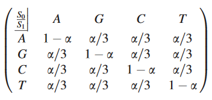
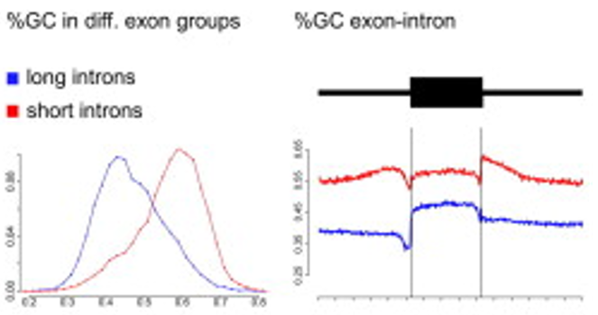
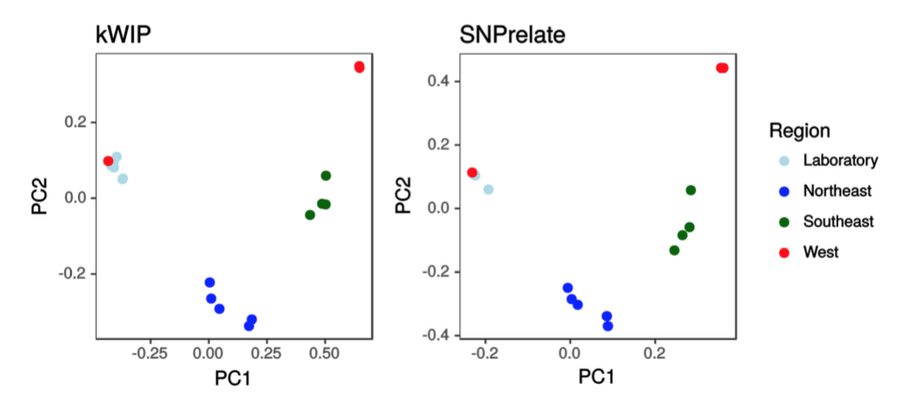
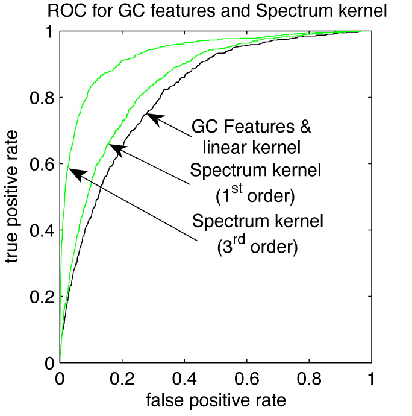
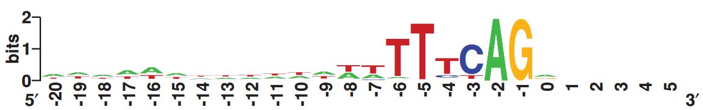
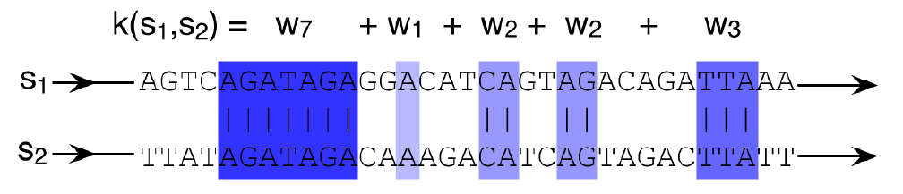
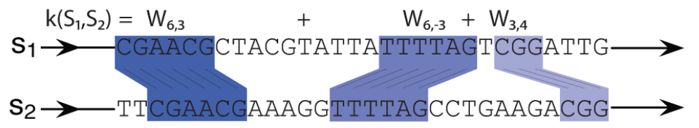
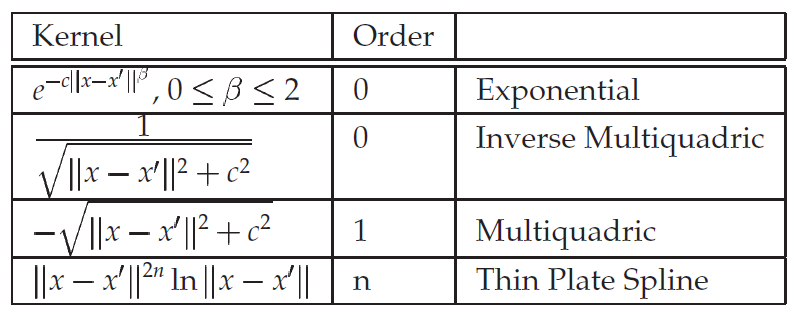

<!-- _class: lead -->

# Representing biological sequences

Cheng Soon Ong

---

# Introduction to machine learning

### ... and why we need to find a numerical representation.

---

## Data (pretend employees)

| Name | Gender | Degree | Postcode | Age | Salary |
|:-----|:------:|:-------|:--------:|----:|-------:|
Aditya | M | MSc | W21BG | 36 | 89563 |
Bob | M | PhD | EC1A1BA | 47 | 123543 |
Chloe | F | BEcon | SW1A1BH | 26 | 23989 |
Daisuke | M | BSc | SE207AT | 68 | 138769 |
Elisabeth | F | MBA | SE10AA | 33 | 113888 |

---

## Data as vectors

Gender ID | Degree | Latitude  |  Longitude  |  Age | Annual Salary |
|:-------:|:-----------:|---------------:|------------:|-----:|--------------:|
|  |   | (degrees) | (degrees) |  | (thousands) |
-1 | 2 | 51.5073 | 0.1290 | 36 | 89.563 |
-1 | 3 | 51.5074 | 0.1275 | 47 | 123.543 |
+1 | 1 | 51.5071 | 0.1278 | 26 | 23.989 |
-1 | 1 | 51.5075 | 0.1281 | 68 | 138.769 |
+1 | 2 | 51.5074 | 0.1278 | 33 | 113.888 |

---

## Regression

$$\mathbf{f} : \mathcal{X} \to \mathcal{Y}$$

- input ($\mathcal{X}$): real valued vector
- output($\mathcal{Y}$): real valued scalar

---

<!-- _class: default -->

## Example of regression task

- $\mathcal{X}$ = age, $\mathcal{Y}$ = salary
- Data from example table (training data)
- Interested in unobserved salary (e.g. $x=60$)

---

# Shameless advertising

- Supervised
    * Regression
    * Binary classification
- Unsupervised
    * Density estimation
    * Dimensionality reduction

Legal PDF at [mml-book.com](mml-book.com)

---

# Representing biological sequences

#### How to convert

TTAGCCTCCAATGCCAAAAAATGGAGGTTAGGAGT

#### to

Gender ID | Degree | Latitude  |  Longitude  |  Age | Annual Salary |
|:-------:|:-----------:|---------------:|------------:|-----:|--------------:|
-1 | 2 | 51.5073 | 0.1290 | 36 | 89.563 |
-1 | 3 | 51.5074 | 0.1275 | 47 | 123.543 |
+1 | 1 | 51.5071 | 0.1278 | 26 | 23.989 |
-1 | 1 | 51.5075 | 0.1281 | 68 | 138.769 |
+1 | 2 | 51.5074 | 0.1278 | 33 | 113.888 |

---

# One hot encoding

First thing to try, and is often already quite good

$$
A = 
\begin{bmatrix}
1\\0\\0\\0
\end{bmatrix},
\quad
C = 
\begin{bmatrix}
0\\1\\0\\0
\end{bmatrix},
\quad
G = 
\begin{bmatrix}
0\\0\\1\\0
\end{bmatrix},
\quad
T = 
\begin{bmatrix}
0\\0\\0\\1
\end{bmatrix}
$$

---

# Why one hot encoding?

- Integer encoding
  $$A=1, \quad C=2, \quad G=3, \quad T=4$$
  * actually assumes that $A$ is nearer to $C$ than $T$
  * also assumes that there is an order, e.g. $A < G$
- Resulting data type is binary, and can be stored efficiently
- Can also encode multiclass labels this way

---
# Use a standard implementation

  

---

<!-- _class: lead -->

# A glimpse of biology

---

<!-- _class: default -->
# Tree of life

Eukaroyte, Bacteria, Archea (discovered in 1970s!)

---

<!-- _class: default -->
# Inside a cell

[https://en.wikipedia.org/wiki/DNA](https://en.wikipedia.org/wiki/DNA)

---

# Central dogma

- **DNA** written 5' to 3'.
  e.g. AATCGAAGTTA
- **RNA** T $\Rightarrow$ U
    e.g. AAUCGAAGUUA
- **Amino acid** 
  - 3 letters of RNA (codon) $\Rightarrow$ amino acid,
  - 20 letter alphabet.

Lewin, Genes

---

# Detecting splice sites

- An acceptor splice site is centered at AG

&emsp; &emsp; intron &emsp; &emsp; &emsp; &emsp; &emsp; &emsp; &emsp; &emsp; &emsp; &emsp; &emsp; &emsp; &emsp; &emsp;  exon

- But not all AG locations are splice sites

---

# Use knowledge to construct features

- exons have higher GC content than introns
- exons code for proteins, look for codons
- Certain motifs are located near the splice site

A short video describing splicing https://youtu.be/aVgwr0QpYNE

---

# Use knowledge to construct features

| index | GC before | GC after | AG**AG**AAG | TTT**AG** | ... | Label |
|:------|----------:|---------:|:-----------:|:---------:|:---:|:-----:|
| $x_1$ | 0.6 | 0.7 | 0 | 1 | ... | +1 |
| $x_2$ | 0.2 | 0.7 | 0 | 1 | ... | +1 |
| $x_3$ | 0.4 | 0.3 | 0 | 1 | ... | -1 |
| $\vdots$ | $\vdots$ | $\vdots$ | $\vdots$ | $\vdots$ | $\vdots$ | $\vdots$ |

---

<!-- _class: lead -->

# The spectrum of a sequence

---

# What is the distribution of GC?

- A pairs with T and G pairs with C
- Look at GC content of introns vs exons

 &emsp; &emsp; &emsp; &emsp; 

Erickson, The Jukes-Cantor Model of Molecular Evolution, 2010
Amit et. al. Differential GC content between exons and intron .., 2012

---

# k-mer

Use the counts of substrings as a feature

- **Counts of 2-mers** of GATTACAAAAA
    -  Maintain a counter for each possible 2-mer
    -  Take a sliding window of length 2 along the read file
    -  Add 1 to the counter.

| 2-mer | AA | AC | AG | AT | CA | CC | CG | CT | GA | GC | GG | GT | TA | TC | TG | TT |
|:--|:-:|:-:|:-:|:-:|:-:|:-:|:-:|:-:|:-:|:-:|:-:|:-:|:-:|:-:|:-:|:-:|
| count | 3 | 1 |  | 1 | 1 |  |  |  | 1 |  |  |  | 1 |  |  | 1 |

---

# How many substrings are there?
### (spoiler: there are a lot of them!)

---

# On the importance of coordinates (I)

### Basis functions

- Consider a vector space $V$
- Let $\mathcal{A} = \{x_1, \ldots, x_k\}$ be a set of vectors in $V$
- The set $\mathcal{A}$ is a generating set if any vector $v\in V$ is a linear combination of $x_1, \ldots, x_k$
- If the generating set $\mathcal{A}$ is the smallest one, then it is a basis.
- (Note we usually intuitively think of orthonormal basis)

See Section 2.6 of mml-book.com

---

# On the importance of coordinates (II)

- **Mapping**
    - Longitude and latitude, for locations on Earth
    - Right ascension and declination, for looking at the sky
- **Image pixels**
    - Object detection and semantic segmentation
    - Simultaneous localization and mapping

---

# Coordinates in genomes

- Due to the way DNA/RNA sequencing works, we do not have a "standard" coordinate system
- Perform sequence alignment to find where a read occured

---

# Another reason for k-mers...
## is to avoid performing sequence alignment

https://en.wikipedia.org/wiki/Alignment-free_sequence_analysis

---

<!-- _class: lead -->
# Comparing two sequences

---

# The main characters (k-mer approach)
- **Genomic reads file**
    The output of high throughput sequencing
- **k-mer counts**
    The number of times a particular subsequence appears in the reads
- **Kernel matrix**
    - Compute similarity between genomes by similarity between its reads
    - Compute similarity between read files by the inner product between k-mer counts

---

# Toy example: GATTACAAAAA

- **Counts of 2-mers**
    -  Maintain a counter for each possible 2-mer
    -  Take a sliding window of length 2 along the read file
    -  Add 1 to the counter.

| 2-mer | AA | AC | AG | AT | CA | CC | CG | CT | GA | GC | GG | GT | TA | TC | TG | TT |
|:--|:-:|:-:|:-:|:-:|:-:|:-:|:-:|:-:|:-:|:-:|:-:|:-:|:-:|:-:|:-:|:-:|
| count | 3 | 1 |  | 1 | 1 |  |  |  | 1 |  |  |  | 1 |  |  | 1 |

---

# Toy example: GATTACAAAAA

| 2-mer | AA | AC | AG | AT | CA | CC | CG | CT | GA | GC | GG | GT | TA | TC | TG | TT |
|:--|:-:|:-:|:-:|:-:|:-:|:-:|:-:|:-:|:-:|:-:|:-:|:-:|:-:|:-:|:-:|:-:|
| count | 3 | 1 |  | 1 | 1 |  |  |  | 1 |  |  |  | 1 |  |  | 1 |

- **Observations**
    -  There are $4^2 = 16$ possible index values
    -  There are many zeros in the k-mer counts

---

# Similarity between two counts

- **First read file** GATTACAAAAA

| 2-mer | AA | AC | AG | AT | CA | CC | CG | CT | GA | GC | GG | GT | TA | TC | TG | TT |
|:--|:-:|:-:|:-:|:-:|:-:|:-:|:-:|:-:|:-:|:-:|:-:|:-:|:-:|:-:|:-:|:-:|
| count | 3 | 1 |  | 1 | 1 |  |  |  | 1 |  |  |  | 1 |  |  | 1 |

- **Second read file** GATTACAAAAACC

| 2-mer | AA | AC | AG | AT | CA | CC | CG | CT | GA | GC | GG | GT | TA | TC | TG | TT |
|:--|:-:|:-:|:-:|:-:|:-:|:-:|:-:|:-:|:-:|:-:|:-:|:-:|:-:|:-:|:-:|:-:|
| count | 3 | 2 |  | 1 | 1 | 1 |  |  | 1 |  |  |  | 1 |  |  | 1 |

---

# Similarity between two counts

- **Similarity = inner product**
    -  Use the same indices for both counts
    -  Compute the standard inner product between two vectors
    -  Only need to consider indices where both are non-zero

---

# Counting k-mers, big k

- **In memory representation** GATTACAAAAA
    We would like to use 21-mers. Cannot fit $4^{21}$ in memory $\approx$ 1TB.

| 2-mer | AA | AC | AG | AT | CA | CC | CG | CT | GA | GC | GG | GT | TA | TC | TG | TT |
|:--|:-:|:-:|:-:|:-:|:-:|:-:|:-:|:-:|:-:|:-:|:-:|:-:|:-:|:-:|:-:|:-:|
|index| 1 | 2 | 3 | 4 | 5 | 6 | 7 | 8 | 9 | 10 | 11 | 12 | 13 | 14 | 15 | 16 |
| count | 3 | 1 |  | 1 | 1 |  |  |  | 1 |  |  |  | 1 |  |  | 1 |

---

| 2-mer | AA | AC | AG | AT | CA | CC | CG | CT | GA | GC | GG | GT | TA | TC | TG | TT |
|:--|:-:|:-:|:-:|:-:|:-:|:-:|:-:|:-:|:-:|:-:|:-:|:-:|:-:|:-:|:-:|:-:|
|index| 1 | 2 | 3 | 4 | 5 | 6 | 7 | 8 | 9 | 10 | 11 | 12 | 13 | 14 | 15 | 16 |
| count | 3 | 1 |  | 1 | 1 |  |  |  | 1 |  |  |  | 1 |  |  | 1 |

- **(hashing) Use a smaller array and hope things work**

| | ?? | ?? | ?? | ?? | ?? | ?? | ?? |
|:--|:-:|:-:|:-:|:-:|:-:|:-:|:-:|
| index | 1 | 2 | 3 | 4 | 5 | 6 | 7 |
| count | 3 | 1 |  | 1 | 1 |  |  |
| | | 1 | | | | 1 |
| | | 1 |

---

#### (hashing) Use a smaller array and hope things work

| | ?? | ?? | ?? | ?? | ?? | ?? | ?? |
|:--|:-:|:-:|:-:|:-:|:-:|:-:|:-:|
| index | 1 | 2 | 3 | 4 | 5 | 6 | 7 |
| count | 3 | 3 |  | 1 | 1 | 1|  |

- The example here used modulo arithmetic (a hash function)
- Perform the inner product using the smaller vector
- Count for TA (index 6 = 13 mod 7) is fine
- Count in index number 2 is not fine (collision)

---

# kWIP: k-mer weighted inner product

-  A hashed based k-mer counter and its inner product
-  Weighted inner product improves performance,\\ especially for low coverage
-  kWIP more accurate than Mash
-  Improves replicate clustering (rice)
-  Discovers population structure (Chalmydomonas)
-  Recovers metagenome relatedness (microbiome)

Murray et. al. kWIP: The k-mer weighted inner product, a de novo estimator of genetic similarity, PLoS Computational Biology, 2017

---

# PCA of Chlamydomonas

(left) from raw reads using kWIP, and (right) long pipeline using SNPs from Zheng et. al. Bioinformatics 2012

---

# How do we reduce collisions? (I)

- Choose a good hash function
    - Modulo arithmetic has many collisions
    - Currently using murmurhash
    https://github.com/aappleby/smhasher
- Use more than one hash function

---

# How do we reduce collisions? (II)

- hashing
- Bloom filters
- locality sensitive hashing
- HyperLogLog
- CountMin sketch
- RACE sketch

Marçais et. al. Sketching and Sublinear Data Struct. in Gen., 2019
Leo Elworth et. al. To Petabytes and beyond, 2020

---

<!-- _class: lead -->
# Inner products and kernels
---

# Inner product

- A bilinear mapping $\langle\cdot,\cdot\rangle$ is:
    - a mapping with two arguments, i.e. $\langle x,y\rangle$
    - and is linear in each argument, e.g. for first argument
    $$
    \langle 2x+5y, z\rangle = 2\langle x,z\rangle + 5\langle y,z\rangle
    $$
- A (real) bilinear mapping that symmetric and positive definite is an inner product.

See Section 3.2 of https://mml-book.com

---

# Kernels

$$k(x,y) = \langle \Phi(x),\Phi(y)\rangle$$

- $\Phi: \mathcal{X}\rightarrow\mathbb{R}^d$ is called the "feature mapping"
- $x$ does not need to be a vector, can be a DNA sequence!
    (even though inner products expects vectors)
- Sometimes we can calculate the similarity faster than we can create the feature vectors

Ben-Hur, et. al., Support vector machines and kernels for computational biology. PLoS Computational Biology 4(10), 2008.

---

# Spectrum kernel

- the count of a particular k-mer in a sequence is a feature
- I.e. feature map $\Phi_\mathrm{spectrum}$ is our counting method
- Spectrum kernel:
    $$k(x,y)_\mathrm{spectrum} = \langle \Phi_\mathrm{spectrum}(x),\Phi_\mathrm{spectrum}(y)\rangle$$
- $\Phi_\mathrm{spectrum}$ has very few non-zeros,
    and kernel can be computed in $\mathcal{O}(|x|+|y|)$.
- weighted sum of kernels is a kernel
- spectrum
- mixed spectrum

---

# Combining kernels

- weighted sum of kernels is a kernel
- Consider k-mers of multiple lengths
- Can allow gaps and mismatches

---

# The importance of position

Sequence logo for acceptor splice sites

- Splice sites have strong consensus sequences
- almost very position is representative of the most frequently occuring nucleotide.

---

# Weighted Degree Kernel

... compares two sequences by identifying the largest matching blocks which contribute depending on their length

Equivalent to a mixture of spectrum kernels (up to order $k$) at
every position for appropriately chosen weights.

---

# Weighted degree kernel with shifts

... allows matching subsequences to be offset from each other

Ben-Hur, et. al., Support vector machines and kernels for computational biology. PLoS Computational Biology 4(10), 2008.

---

# Distances vs inner products

#### Intuition

- distances = bigger number means things are different
- kernels = bigger number means things are more similar

#### Converting kernels to distances

- Note that squared norms can be expressed as inner products
- The (squared) distance between $x$ and $y$ is
$$d^2(x,y) = ||x - y||^2 = k(x,x) + x(y,y) - 2k(x,y)$$

---

# Convert distances to kernels

Try the exponential of the negative squared distance, 
appropriately scaled.

Schölkopf, Smola, Learning with kernels, 2002 

---

<!-- _class: lead -->
# Natural language models
## (2 slides)

---

# k-mers and n-grams

GATTACAAAAA

| 2-mer | AA | AC | AG | AT | CA | CC | CG | CT | GA | GC | GG | GT | TA | TC | TG | TT |
|:--|:-:|:-:|:-:|:-:|:-:|:-:|:-:|:-:|:-:|:-:|:-:|:-:|:-:|:-:|:-:|:-:|
| count | 3 | 1 |  | 1 | 1 |  |  |  | 1 |  |  |  | 1 |  |  | 1 |

https://phrasesinenglish.org

---

# Embed = find a feature vector

Some papers about language models applied to DNA

- BioSeq-BLM: a platform for analyzing DNA, RNA and protein sequences based on biological language models
    https://doi.org/10.1093/nar/gkab829
- The language of proteins: NLP, machine learning & protein sequences
    https://doi.org/10.1016/j.csbj.2021.03.022
- Biological structure and function emerge from scaling unsupervised learning to 250 million protein sequences
    https://doi.org/10.1073/pnas.2016239118

---

# Representing biological sequences

- one hot encoding
- DNA and RNA sequences are a 4 letter alphabet
- Protein sequences are a 20 letter alphabet
- Use knowledge to design features
- counting and hashing
- kmers and spectrum kernels
- language models

