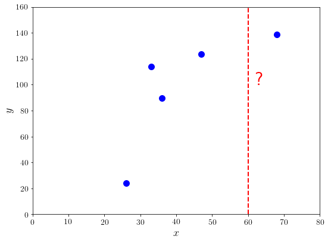
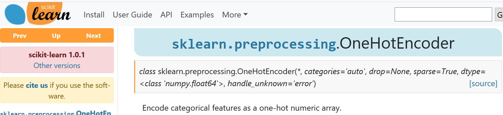
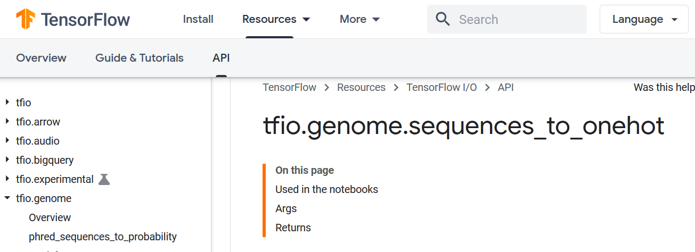
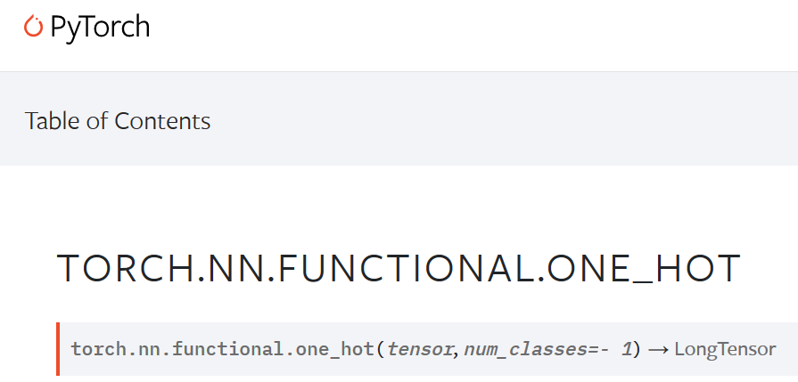
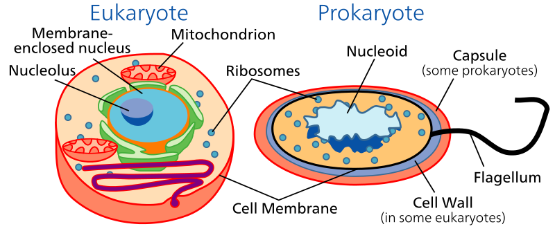
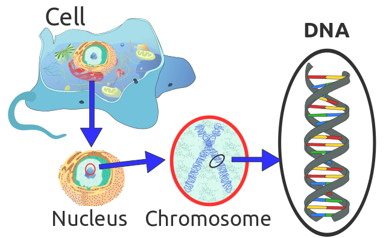
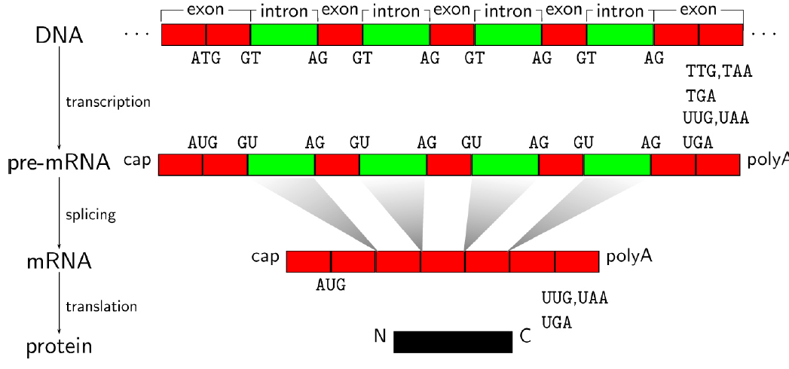
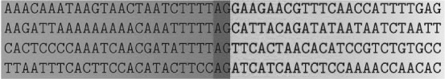

# test slide

- highlight
- cite
- dna
- footnote

---
<!-- _class: lead -->

# Representing biological sequences

Cheng Soon Ong

---

# Introduction to machine learning

### ... and why we need to find a numerical representation.

---

## Data (pretend employees)

| Name | Gender | Degree | Postcode | Age | Salary |
|:-----|:------:|:-------|:--------:|----:|-------:|
Aditya | M | MSc | W21BG | 36 | 89563 |
Bob | M | PhD | EC1A1BA | 47 | 123543 |
Chloe | F | BEcon | SW1A1BH | 26 | 23989 |
Daisuke | M | BSc | SE207AT | 68 | 138769 |
Elisabeth | F | MBA | SE10AA | 33 | 113888 |

---

## Data as vectors

Gender ID | Degree | Latitude  |  Longitude  |  Age | Annual Salary |
|:-------:|:-----------:|---------------:|------------:|-----:|--------------:|
|  |   | (degrees) | (degrees) |  | (thousands) |
-1 | 2 | 51.5073 | 0.1290 | 36 | 89.563 |
-1 | 3 | 51.5074 | 0.1275 | 47 | 123.543 |
+1 | 1 | 51.5071 | 0.1278 | 26 | 23.989 |
-1 | 1 | 51.5075 | 0.1281 | 68 | 138.769 |
+1 | 2 | 51.5074 | 0.1278 | 33 | 113.888 |

---

## Regression

$$\mathbf{f} : \mathcal{X} \to \mathcal{Y}$$

- input ($\mathcal{X}$): real valued vector
- output($\mathcal{Y}$): real valued scalar

---

<!-- _class: default -->

## Example of regression task

- $\mathcal{X}$ = age, $\mathcal{Y}$ = salary
- Data from example table (training data)
- Interested in unobserved salary (e.g. $x=60$)

---

# Shameless advertising

- Supervised
    * Regression
    * Binary classification
- Unsupervised
    * Density estimation
    * Dimensionality reduction

Legal PDF at [mml-book.com](mml-book.com)

---

# Representing biological sequences

## How to convert

TTAGCCTCCAATGCCAAAAAATGGAGGTTAGGAGT

## to

Gender ID | Degree | Latitude  |  Longitude  |  Age | Annual Salary |
|:-------:|:-----------:|---------------:|------------:|-----:|--------------:|
-1 | 2 | 51.5073 | 0.1290 | 36 | 89.563 |
-1 | 3 | 51.5074 | 0.1275 | 47 | 123.543 |
+1 | 1 | 51.5071 | 0.1278 | 26 | 23.989 |
-1 | 1 | 51.5075 | 0.1281 | 68 | 138.769 |
+1 | 2 | 51.5074 | 0.1278 | 33 | 113.888 |

---

# One hot encoding

First thing to try, and is often already quite good

$$
A = 
\begin{bmatrix}
1\\0\\0\\0
\end{bmatrix},
\quad
C = 
\begin{bmatrix}
0\\1\\0\\0
\end{bmatrix},
\quad
G = 
\begin{bmatrix}
0\\0\\1\\0
\end{bmatrix},
\quad
T = 
\begin{bmatrix}
0\\0\\0\\1
\end{bmatrix}
$$

---

# Why one hot encoding?

- Integer encoding
  $$A=1, \quad C=2, \quad G=3, \quad T=4$$
  * actually assumes that $A$ is nearer to $C$ than $T$
  * also assumes that there is an order, e.g. $A < G$
- Resulting data type is binary, and can be stored efficiently
- Can also encode multiclass labels this way

---
# Use a standard implementation

  

---

<!-- _class: lead -->

# A glimpse of biology

---

<!-- _class: default -->
# Tree of life

Eukaroyte, Bacteria, Archea (discovered in 1970s!)

---

<!-- _class: default -->
# Inside a cell

[https://en.wikipedia.org/wiki/DNA](https://en.wikipedia.org/wiki/DNA)

---

# Central dogma

- **DNA** written 5' to 3'.
  e.g. AATCGAAGTTA
- **RNA** T $\Rightarrow$ U
    e.g. AAUCGAAGUUA
- **Amino acid** 
  - 3 letters of RNA (codon) $\Rightarrow$ amino acid,
  - 20 letter alphabet.

Lewin, Genes

---

# Detecting splice sites

- An acceptor splice site is centered at AG

&emsp; &emsp; intron &emsp; &emsp; &emsp; &emsp; &emsp; &emsp; &emsp; &emsp; &emsp; &emsp; &emsp; &emsp; &emsp; &emsp;  exon
- But not all AG locations are splice sites

---

# Use knowledge to construct features

- exons have higher GC content than introns
- exons code for proteins, look for codons
- Certain motifs are located near the splice site

A short video describing splicing https://youtu.be/aVgwr0QpYNE

---

# Use knowledge to construct features

| index | GC before | GC after | AG**AG**AAG | TTT**AG** | ... | Label |
|:------|----------:|---------:|:-----------:|:---------:|:---:|:-----:|
| $x_1$ | 0.6 | 0.7 | 0 | 1 | ... | +1 |
| $x_2$ | 0.2 | 0.7 | 0 | 1 | ... | +1 |
| $x_3$ | 0.4 | 0.3 | 0 | 1 | ... | -1 |
| $\vdots$ | $\vdots$ | $\vdots$ | $\vdots$ | $\vdots$ | $\vdots$ | $\vdots$ |

---

<!-- _class: lead -->

# The spectrum of a sequence

---

# What is the distribution of A,C,G,T?

show some bar plots of relative abundance

---

# DNA comes in pairs

- A pairs with T and G pairs with C
- Look at GC content of introns vs exons

---

# What about the distribution of AA, AC, AG, AT, CA, CC, ...

show relative abundance

---

# k-mer

Use the counts of substrings as a feature

---

# How many substrings are there?
### (spoiler: there are a lot of them!)

---

# How to count the number of occurances

- hashing
- Murray et. al. kWIP: The k-mer weighted inner product, a de novo estimator of genetic similarity, PLoS Computational Biology, 2017

---

# Limiting the size of the index

- hashing
- Bloom filters
- locality sensitive hashing
- RACE sketch
- see survey paper

---

<!-- _class: lead -->
# Comparing two sequences

---

# Inner product

See Chapter 3 of [mml-book.com](https://mml-book.com)

---

# Kernels

Sometimes we can calculate the similarity faster than we can create the feature vectors

Asa Ben-Hur, Cheng Soon Ong, Sören Sonnenburg, Bernhard Schölkopf, and Gunnar Rätsch. Support vector machines and kernels for computational biology. PLoS Computational Biology 4(10), e1000173, 2008.

---

# Spectrum kernel

- weighted sum of kernels is a kernel
- spectrum
- mixed spectrum

---

# The importance of position

Position weight matrices

---

# Weighted degree kernel

Consider substrings at each positions separately

---

# Distances vs inner products

- norm
- $||x - y||$

---

# Convert distances to kernels

- exp

---

<!-- _class: lead -->
# Natural language models

---

# k-mers and n-grams

---

# Embed = find a feature vector

Some papers about language models applied to DNA

---

# Representing biological sequences

- one hot encoding
- DNA and RNA sequences are a 4 letter alphabet
- Protein sequences are a 20 letter alphabet
- Use knowledge to design features
- counting and hashing
- kmers and spectrum kernels
- language models

