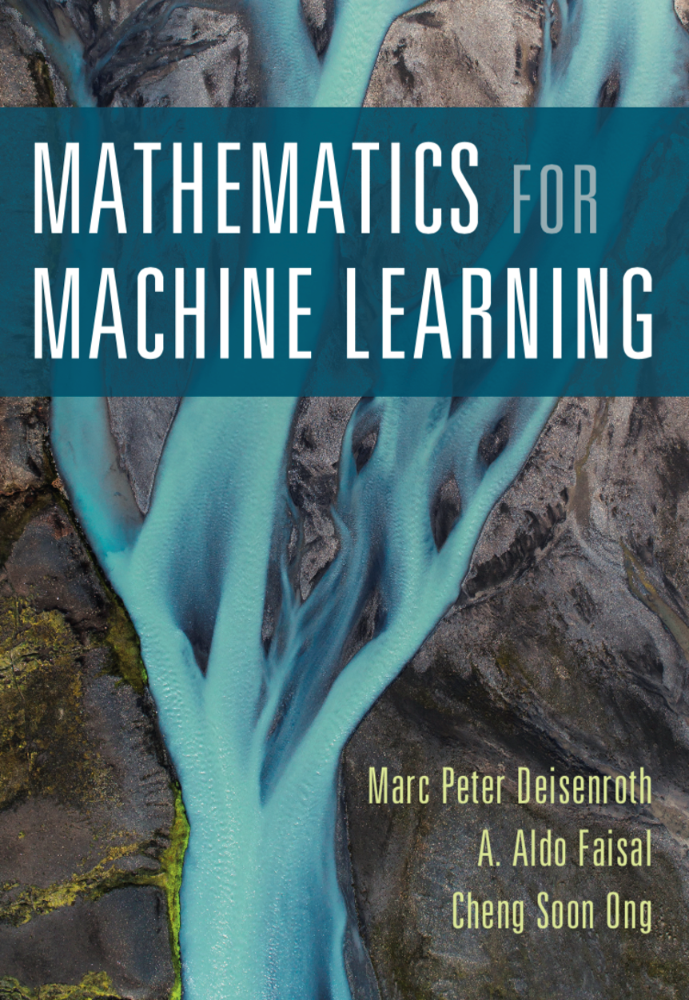

# Representing biological sequences

Cheng Soon Ong

---

# Introduction to machine learning

### ... and why we need to find a numerical representation.

---

## Data (pretend employees)

| Name | Gender | Degree | Postcode | Age | Salary |
|:-----|:------:|:-------|:--------:|----:|-------:|
Aditya | M | MSc | W21BG | 36 | 89563 |
Bob | M | PhD | EC1A1BA | 47 | 123543 |
Chloe | F | BEcon | SW1A1BH | 26 | 23989 |
Daisuke | M | BSc | SE207AT | 68 | 138769 |
Elisabeth | F | MBA | SE10AA | 33 | 113888 |

---

## Data as vectors

Gender ID | Degree | Latitude  |  Longitude  |  Age | Annual Salary |
|:-------:|:-----------:|---------------:|------------:|-----:|--------------:|
|  |   | (degrees) | (degrees) |  | (thousands) |
-1 | 2 | 51.5073 | 0.1290 | 36 | 89.563 |
-1 | 3 | 51.5074 | 0.1275 | 47 | 123.543 |
+1 | 1 | 51.5071 | 0.1278 | 26 | 23.989 |
-1 | 1 | 51.5075 | 0.1281 | 68 | 138.769 |
+1 | 2 | 51.5074 | 0.1278 | 33 | 113.888 |

---

## Regression

$$\mathbf{f} : \mathcal{X} \to \mathcal{Y}$$

- input ($\mathcal{X}$): real valued vector
- output($\mathcal{Y}$): real valued scalar

---

<!-- _class: lead -->

## Example of regression task

- $\mathcal{X}$ = age, $\mathcal{Y}$ = salary
- Data from example table (training data)
- Interested in unobserved salary (e.g. $x=60$)

---

# Shameless advertising

- Supervised
  * Regression
  * Binary classification
- Unsupervised
  * Density estimation
  * Dimensionality reduction

---

# Test slide

1. item
- another
3. item

---

Sequences
- DNA and RNA sequences are a 4 letter alphabet
- Protein sequences are a 20 letter alphabet
- one hot encoding
- kmers and spectrum kernels
- counting and hashing
- language models

---
Opportunities and challenges
- graphs, geometric deep learning
- Hard and soft constraints
- Really need causal graphs, and dynamical systems
