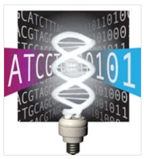

<!-- _class: lead -->

# Opportunities and challenges in the sequencing revolution

Cheng Soon Ong

---

The bottleneck in genome sequencing is no longer data generation 
-- the computational challenges around data analysis, display and integration are now rate limiting.

    New approaches and methods are required to meet these challenges.

    Green, Guyer and National Human Genome Research Institute
    Charting a course for genomic medicine from base pairs to bedside, Nature 2011.

---

<!-- _class: lead -->

# A glimpse of molecular biology

---
# Central dogma

- **DNA** written 5' to 3'.
  e.g. AATCGAAGTTA
- **RNA** T $\Rightarrow$ U
    e.g. AAUCGAAGUUA
- **Amino acid** 
  - 3 letters of RNA (codon) $\Rightarrow$ amino acid,
  - 20 letter alphabet.

Lewin, Genes

---
<!-- _class: lead -->

# Gene finding

---

# Genes are pure information objects

“There can be little doubt,” philosopher and biochemist Lenny Moss claimed in 2003, “that the idea of ‘the gene’ has been the central organizing theme of twentieth century biology”. And yet it is clear that the science of genetics never provided one generally accepted definition of the gene.
https://plato.stanford.edu/entries/gene/

---

# Gene finding

#### Given the DNA, predict resulting mRNA and protein

- Requires very accurate identification of
    - splice sites, translation \& transcription starts \& stops
    - sites of regulation (transcription, splicing, etc.)
- Develop methods to integrate single site predictions
    - usually HMMs and recurrent models
    - Novel learning methods for structured outputs

---

# Transcription start

- POL II binds to a rather vague region of  $\approx [-20,+20]$ bp
- Upstream of  TSS: promoter, with transcription factor binding sites
- Downstream of TSS: 5' UTR, and further downstream coding regions and introns (different statistics)
- 3D structure allows the transcription factors to bind

---

# Transcription termination

- Polyadenylation signal (AATAAA or variants) 10-30 bp upstream
- T-rich or GT-rich elements 20-40 bp downstream
- Transcription end is several hundreds of bp after 3' cleavage site, mechanism poorly understood

---

# Splice sites (I)

- **Finding Intron-Exon junctions**
    
    known splice site
    - true sites: fixed-length window around splice site
    - decoys sites: generated by shifting the window

---

# Splice sites (II)

- **Finding Intron-Exon junctions**
    
    $\Rightarrow$ Very unbalanced problem (1:200)
    $\Rightarrow$ Billions of data points from sequence databases
    $\Rightarrow$ Large scale methods necessary

---

# Splice forms

Predict a sequence of binary decisions
Schweikert et. al. mGene: accurate SVM-based gene finding with an application to nematode genomes, 2009

---

# Alternative splicing

- Nematodes and humans have roughly the same number of genes.
- C. elegans has 959 cells.

Kahles et. al., SplAdder: identification, quantification and testing of alternative splicing events from RNA-Seq data, 2016

---

# Regulation and control

- Genes are regulated by proteins called transcription factors (and promoters, enhancers, ribosomal binding site, etc.)
- Environment, e.g. metabolism (internal), temperature (external)

Alon, An Introduction to Systems Biology, 2007
Lawrence et. al. Learning and Inference in Computational Systems Biology, 2010

---

# Chromatin structure

- DNA packed tightly in nucleus
- DNA wrapped around histones to form nucleosomes
- Nucleosomes organised into chromatin
- Transcription accessibility
- DNA repair

https://www.nature.com/scitable/topicpage/dna-packaging-nucleosomes-and-chromatin-310/

---

# Methylation and Epigenetics

- Environmental effects change the genome (and may be inherited)
- Can detect changes using sequencing methods

Aristizabal et. al. A primer on epigenetics, 2020
Jonkhout et. al. The RNA modification landscape in human disease, 2017.

---

# Glimpse of molecular biology

- **DNA** Positive strand, written 5' to 3'.
      e.g. AATCGAAGTTA
- **RNA** T $\Rightarrow$ U
      e.g. AAUCGAAGUUA
- **Amino acid** 3 letters of RNA (codon) $\Rightarrow$ amino acid
- **Splicing** pre-mRNA to mature mRNA
- **Transcription factor** Regulate expression of gene, 
    through promoters and repressors
- **Epigenetics** Methylation, Chromatin marks

---
<!-- _class: lead -->

# The sequencing revolution

---

# History of sequencing

-  1960s: DNA - properties, proto sequencing
-  70s-90s: Manual sequencing - Sanger, Maxam-Gilbert
-  90s: Automated Sanger - flourescent, clones, colony picking
-  2003: Human genome - 25 cents per 1000 bases
-  00s: NGS, Clusters - 454-Roche, Solexa-Illumina, Ion Torrent
-  Illumina HiSeq X Ten: 6 billion 150 base sequences in 3 days

http://phylogenomics.blogspot.com.au/2015/10/evolution-of-dna-sequencing-talk-2015.html

---

# $1000 human genome

- **Data volume**
    -  HiSeq X Ten: 12 GB per hour
    -  700MB per human genome $\sim$ 200GB reads
- **Multiple versions**
    -  Multiplexing - tag sequences
    -  Small amounts of DNA
    -  Longer reads

- **Small sequencers**
    -  Single cell sequencing: PacBio
    -  Real time sequencing: Oxford Nanopore

---

<!-- _class: lead -->
DNA sequences: 6 billion reads, each 150 bases, ~$\frac{1}{2}$TB

# So what?

---

# We have a new cheap sensor

 &emsp; 

---

# DNA sequencing

- **Analogy: Shotgun sequencing**
    Take many copies of a text, split at random points, reconstruct.
- **Alignment**
    - Dynamic programming
    - Needleman-Wunsch and Smith-Waterman
- **Assembly**
    - reference genome vs de-novo vs pan-genome
    - Bridges of K\"onigsberg $\rightarrow$ de Bruijn graphs
    http://www.nature.com/nmeth/journal/v9/n4/full/nmeth.1935.html

---

# Cohort (I)

- **Single Nucleotide Variation**
    -  Recall two copies of chromosomes
    -  at every location: AA, AB, BB
    -  Noise free, high coverage $\Rightarrow$ frequency = probability
    -  Probabilistic methods for maximum a posteriori estimation
    -  Correlations along the genome

1000 genomes project
https://www.internationalgenome.org/

---

# Cohort (II)

- **Structural variation**
    -  copy number variation
    -  insertions, deletions
    -  inversion, translocation
    Cmero et. al. Inferring structural variant cancer cell fraction, 2020

- **Study cohort** 
    - germline vs somatic mutations
    https://www.ncbi.nlm.nih.gov/books/NBK21894/

---

## Replication
#### Multiple samples to estimate experimental variation
- **Techical**
    -  Effect of measurement instrument
    -  Different days, researcher
    -  Usually same biological sample
- **Biological**
    -  Effect of biological development
    -  Different individuals of same ``species''

https://xkcd.com/2533/

---

# RNA-seq

- **Chemistry** 
    - Convert RNA to DNA
- **Gene Expression**
    -  Recall: mRNA translated to proteins
    -  Which genes are expressed in what tissues at which levels?
    -  What are the regulators of a particular gene?
    -  How does treatment change expression (differential expression)?
    https://www.encodeproject.org/

---

# *-seq

- RNA-seq
- Hi-C-seq
- Sort-seq
- ChIP-seq
- scRNA-seq
$$\vdots$$
- hundreds more

https://liorpachter.wordpress.com/seq/
Image from Lior Pachter's ISMB 2013 keynote

