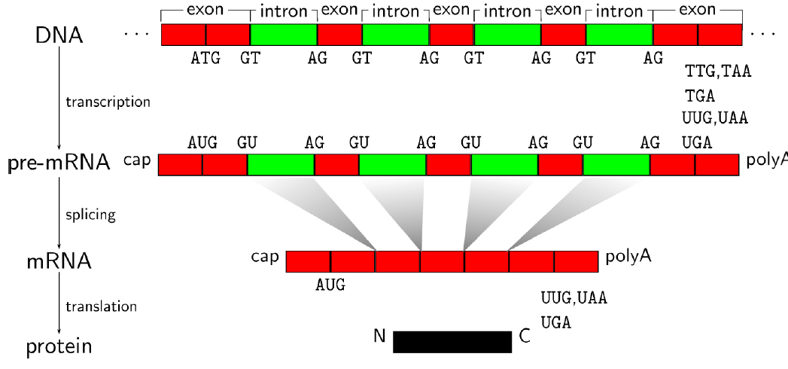

# test slide

- highlight
- cite
- dna
- footnote

---
<!-- _class: lead -->

# Opportunities and challenges in the sequencing revolution

Cheng Soon Ong

---

The bottleneck in genome sequencing is no longer data generation 
-- the computational challenges around data analysis, display and integration are now rate limiting.

    New approaches and methods are required to meet these challenges.

    Green, Guyer and National Human Genome Research Institute
    Charting a course for genomic medicine from base pairs to bedside, Nature 2011.

---

<!-- _class: lead -->

# A glimpse of molecular biology

---
# Central dogma

- **DNA** written 5' to 3'.
  e.g. AATCGAAGTTA
- **RNA** T $\Rightarrow$ U
    e.g. AAUCGAAGUUA
- **Amino acid** 
  - 3 letters of RNA (codon) $\Rightarrow$ amino acid,
  - 20 letter alphabet.

Lewin, Genes

---
<!-- _class: lead -->

# Gene finding

---

# Genes are pure information objects

- no physical structure

---

# Gene finding

---

# Transcription start

---

# Transcription termination

---

# Splice sites

---

# Splice forms

---

# Alternative splicing

---

# Regulation and control

---

# Chromatin structure

---

# Methylation

---

# Glimpse of molecular biology

- **DNA** Positive strand, written 5' to 3'.
      e.g. AATCGAAGTTA
- **RNA** T $\Rightarrow$ U
      e.g. AAUCGAAGUUA
- **Amino acid** 3 letters of RNA (codon) $\Rightarrow$ amino acid
- **Splicing** pre-mRNA to mature mRNA
- **Transcription factor** Regulate expression of gene, 
    through promoters and repressors
- **Epigenetics** Methylation, Chromatin marks

---
<!-- _class: lead -->

# The sequencing revolution

---

# History of sequencing

---

# $1000 human genome

---

<!-- _class: lead -->
DNA sequences: 6 billion reads, each 150 bases, ~$\frac{1}{2}$TB

# So what?

---

# We have a new cheap sensor

---

# DNA sequencing

---

# Cohort

---

# Replication

---

# RNA-seq

---

# *-seq

- RNA-seq
- Hi-C-seq
- Sort-seq
- ChIP-seq
$$\vdots$$
- hundreds more

https://liorpachter.wordpress.com/seq/

